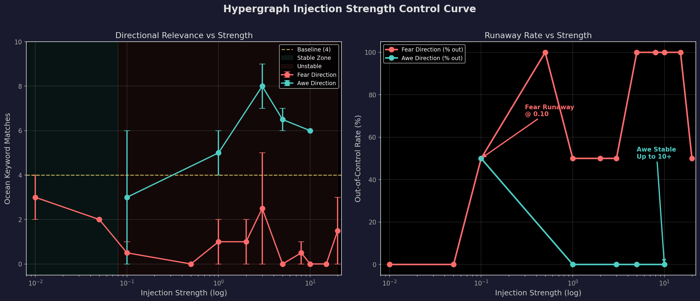

# 海波（Hypergraph）原型验证报告

> **让 AI "想好再说"——一个基于图论的自适应认知架构**

---

## 一、项目定位

海波（Hypergraph）是一个位于大语言模型（LLM）上游的认知架构。它不是另一个 LLM，而是一个**语义组织层**——它的职责不是生成文字，而是决定 LLM 该往哪个方向"想"。

核心理念：**语言不是思维本身，是思维在低维空间的投影。** LLM 是嘴巴，海波才是大脑。

---

## 二、验证链路（全部跑通 ✅）

```
用户输入 → 意图提取 → 激活扩散 → 双语者注入 → LLM 生成
```

整条链路上半年从零搭建，目前已全链路贯通。

---

## 三、五个关键实验

### H10：常识加载 + 基础链路

搭建 31 个常识节点（时间/空间/情感/逻辑/社交/自然），34 条语义边，构成海波的初始知识图谱。

### H11a：端到端首跑

Qwen2.5-7B 首次通过海波驱动生成文本。模型 4-bit 量化后占用 ~5GB，在 RTX 4060 8GB 上流畅运行。

### H11b-c：方向性注入验证

发现**根因问题**：单字词的中间层 embedding 几乎不可区分（「悲伤」vs「快乐」余弦相似度 0.9998），导致注入无效。

**修复方案**：将节点文本从单字词改为短语（如「悲伤」→「深深的悲伤和失落感」），embedding 区分度从 0.9998 降至 0.40，方向引导生效。

### H11e：两种注入方式对比

| 注入方式 | 效果 | 状态 |
|---------|------|------|
| Embedding 层虚拟 token 注入 | 方向性差异可观察 | ✅ 主力方案 |
| 中间层 Hidden State 注入 | 归一化后可用，区分度弱 | ⚠️ 备用方案 |

### H12：双海波拓扑演化（核心验证）

**两个相同的海波**，通过不同方向的交互演化，产生截然不同的边权重：

| 边 | 海波A（敬畏方向） | 海波B（恐惧方向） |
|---|---|---|
| 大海→敬畏 | **0.99** ↑ | 0.34 ↓ |
| 大海→恐惧 | 0.34 ↓ | **0.99** ↑ |

生成文本对比：
- **海波A**：大海的壮丽与深邃、哲学思考、自然之美
- **海波B**：焦虑处理建议、考题模式

**结论：海波的内部拓扑演化确实驱动了 LLM 的输出方向。** 🎉

### H13：控制曲线校准

绘制注入强度的"三区间"控制曲线：

| 方向 | 稳定区间 | 特性 |
|------|---------|------|
| **敬畏** | [1.0, 10.0+] | 宽且稳定，天然契合大海主题 |
| **恐惧** | [0.01, 0.05] | 极窄，超出即跳转到焦虑→考题模式 |

关键发现：**方向性不对称**——引导方向与 prompt 主题的契合度决定了稳定区间的宽度。

---

## 四、技术原理

### 双语者注入

每个常识节点在 LLM 的中间层有一个 embedding 坐标。激活时，这些坐标作为虚拟 token 拼接到输入 embedding 前，让 LLM 在"想好"之前就带着概念倾向开始生成。

### 双时间尺度动力学

- **快层**：激活扩散（Hopfield 网络变体，数毫秒收敛）
- **慢层**：赫布学习 + 参考拉回 + 动量阻尼（边权重随交互演化）

---

## 五、当前状态

```
✅ 工程链路贯通（常识→激活→注入→生成）
✅ 注入机制可用（双语者注入方向引导有效）
✅ 拓扑演化驱动 LLM（H12 核心验证通过）
✅ 控制曲线标定（H13 稳定区间量化）
⚠️ 恐惧方向控制窄（需拓扑优化）
⬜ 理解→内化前端（尚未实现）
```

---

## 六、控制曲线图



左图：海洋关键词命中数随注入强度的变化。敬畏方向（青色）在 1-10+ 强度下保持高相关性；恐惧方向（红色）在 0.10 即进入失控。

右图：失控率曲线。恐惧方向在 0.10 处门槛陡降，敬畏方向全程稳定。

---

## 七、下一步

1. **拓扑优化**：解决恐惧方向的失控传播链（恐惧→紧张→焦虑→考题）
2. **理解前端**：实现"输入→映射→内化"阶段
3. **端到端应用**：选择垂直场景（如写作辅助/情感引导）进行产品化验证

---

*本文由 零号词云 × AI 协作完成*

*项目地址：github.com/madheu/intentCloud*
