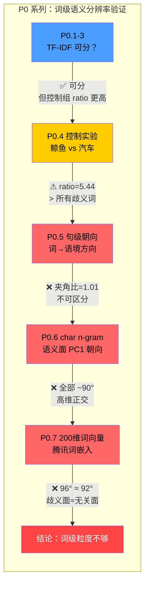
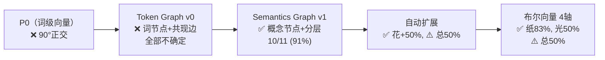

# intentCloud — Haibo 研究项目

**从"序列生成"转向"语义组织 → 语言表达"的双阶段系统。**  
核心问題：**Meaning 是如何形成的？**

---

## 项目状态

> **2026-07-18 重要更新：核心路线变更**

### Haibo 1.0（已完结）

一条完整的研究路径已被实验和数学分析证伪：

| 核心路线 | 结论 | 证据 |
|---------|:---:|------|
| 图（IntentCloud）→ embedding 注入 → LLM 控制生成方向 | **不可行** | 两轮 pilot 实验：I(a\*; y\_LLM) ≈ 0，类间/类内 embedding 比 = 0.93 \~ 0.99 |
| 赫布学习 + 扩散的双层动力学稳定共存 | **不可行** | 数学证明 + 代码反例：3 节点全连通图 3 步后 ρ(A)=1.099 发散 |

**注入路线已关闭。** 原因不是"调参不够"，是结构性的：4 个虚拟 token 的信号输入被 LLM 千亿参数的自回归分布完全淹没。

### Haibo 2.0（探索中）

新的研究假设链（见 `Haibo-Research/01_Core_Hypothesis.md`）：

```text
Input → Token Graph → Semantic Emergence → Context → Intent → Language
```

语义应当从 Token 关系中自然涌现，而非手编节点 + 外部注入。

#### Resolve 系列（P0 实验）

<details>
<summary><b>📊 P0 实验全貌 — 点击展开</b></summary>



### 实验结果一览

| 实验 | 问题 | 方法 | 关键数字 | 判定 |
|:---:|:----|:----|:--------:|:----:|
| **P0.1** | 歧义词可分词义？ | TF-IDF 苹果一词 | ratio=1.42 | ✅ |
| **P0.2** | 扩展到 4 词？ | 苹果/杜鹃/小米/长城 | 全部 >1.2 | ✅ |
| **P0.3** | 真实数据 vs 手写？ | Wikipedia 语料 + 去英数字 | 3.64~2.33 | ✅ |
| **P0.4** | 控制：不相关概念？ | 鲸鱼 vs 汽车 | ratio=**5.44** | ⚠️ 高于歧义词！ |
| **P0.5** | 词→语境朝向？ | 语境质心方向夹角 | 夹角=22°, 比=**1.01** | ❌ |
| **P0.6** | 语义面 PC1 朝向？ | char n-gram 词面 | 全部 **~90°** | ❌ |
| **P0.7** | 真实词向量能区分？ | 腾讯 200 维嵌入 | 96° ≈ 92°(控制) | ❌ |

### Ratio 对比（控制组归一化）

```
       ┌────────────────────────────────────┐
       │         控制组：鲸鱼 vs 汽车         │
       │         ratio = 5.44 (基线)         │
       │                                     │
┌──────┼────────────────────────────────────┤
│ 苹果  │████████████████████████▋  3.64     │
│ 杜鹃  │█████████████████▎       2.33      │
│ 小米  │████████████████████▎    2.81      │
│ 长城  │███████████████████████▏ 3.24      │
│ 鲸鱼  │███████████████████████████████ 5.44│
│ v汽车 │                                     │
└──────┴─────────────────────────────────────┘
       0     1     2     3     4     5     6
```

**结论**：所有歧义词对的 ratio 均**低于**完全不相关概念的 ratio。TF-IDF char n-gram 测量的主要是话题风格差异，真实的语义歧义分辨率（归一化后）仅 0.43~0.67。

</details>

**结论**：在词级粒度下，无论 char n-gram 还是 200 维词向量，语义歧义的朝向信号均淹没在噪声中。词级分辨率不够。

#### P0-A 系列：概念域 → 布尔向量进化

P0 证明词级不行后，转向图级消歧。经过了三个设计迭代：



| 方法 | 苹果 | 纸 | 光 | 花 | 行 | 口 | 总计 |
|:----:|:---:|:--:|:--:|:--:|:--:|:--:|:---:|
| 手写概念域 | 82% | 17% | 33% | 33% | 0% | 75% | 45% |
| 词向量自动扩展 | 73% | 17% | 17% | 83% | 20% | 75% | 50% |
| **布尔4轴** | 45% | **83%** | **50%** | 50% | **40%** | 25% | **50%** |

**当前方向**：4轴布尔向量（天/地/人/心）——每个词用4个布尔值编码语义，歧义消解=语境词向量累加→点积比较候选义项。需要补词表后验证是否全面优于概念域方法。

详细实验日志：`Haibo-Research/06_Experiment/`

---

## 项目结构

```text
Haibo-Research/           # 研究记录体系（结构化审查 + 实验）
├── 00_Project_Overview.md
├── 01_Core_Hypothesis.md
├── 02_Architecture.md
├── 03_Research_Log.md
├── 05_Decision_Log.md
├── 04_Review/             # 三角色审查记录
└── 06_Experiment/         # 实验日志

IntCog-R/                 # Haibo 1.0 代码（入口：scripts/talk_to_haibo.py）
├── core/                 # 核心模块
├── scripts/              # 交互 + 实验脚本
├── data/                 # 常识图数据
├── tests/                # ~226 单元测试
└── docs/
```

---

## 核心资产（Haibo 1.0 遗留，独立于注入路线）

- **36 节点常识图 + 扩散引擎**：语义关系拓扑，可作为对话上下文分析器
- **GraphInterpreter + PromptBuilder**：图→Decision(topic/tone/emotion) → 自然语言 prompt 管道
- **H17 语义理解层（5 模块，26 测试）**：指代消解、矛盾处理、情绪球、结构化记忆
- **Haibo Memory MCP Server**：Hermes 可直接调用的记忆工具
- **talk_to_haibo.py**：纯 prompt 通信的交互界面（无注入）

更多细节：`Haibo-Research/`

---

## 快速开始

### Haibo 1.0 — 图状态可见的交互

```bash
git clone https://github.com/madheu/intentCloud.git
cd intentCloud/IntCog-R
pip install torch transformers
# 需先下载 Qwen2.5-1.5B 到 models/qwen2.5-1.5b
python scripts/talk_to_haibo.py
```

### 阅读研究记录

```bash
ls Haibo-Research/
```

从 `00_Project_Overview.md` 和 `\03_Research_Log.md` 开始。

---

## 许可证

Apache 2.0 License.
