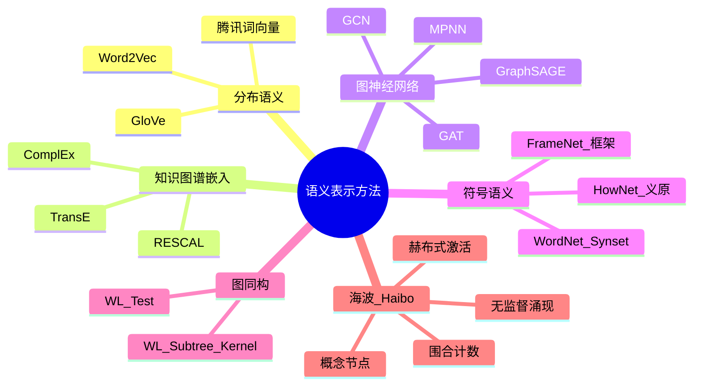
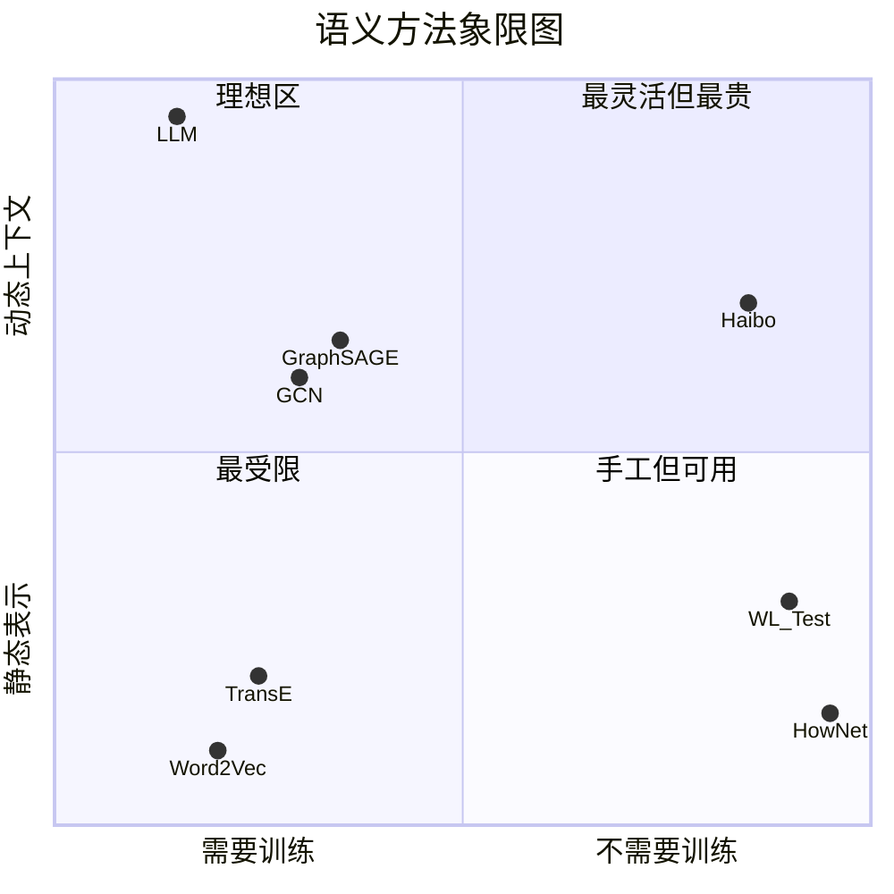

# 学术地图：海波在语义研究中的位置

> 基于 9 篇论文的方法论卡片，定位海波与其他方法的关系。
> 2026-07-22

---

## 一、三轴坐标系

海波与其他方法最关键的差异可以压缩到三个维度：

### 轴1：训练需求（从无到有）

```
无训练 ←——————————————→ 需要训练
  │                            │
  WL     HowNet  海波    Word2Vec  TransE  GCN  LLM
  纯算法  人工构建  赫布式    自监督    三元组  监督  预训练+微调
  无参数  无参数    局部激活   训练嵌入   训练    反向传播
```

**海波位置**：最左端，跟 WL、HowNet 同侧——这是根本立场。

### 轴2：语义表示方式（从离散到连续）

```
离散符号 ←——————————————→ 连续向量
   │                            │
 HowNet    WL    海波      Word2Vec  GCN/TransE  LLM
 义原组合  节点标签  概念激活   词向量    图嵌入     隐藏状态
```

**海波位置**：偏左——概念节点是离散的，激活强度是连续的（混合）。

### 轴3：上下文敏感度（从静态到动态）

```
静态 ←——————————————————→ 动态
  │                            │
 Word2Vec  TransE  HowNet   海波     GCN    LLM
 一词一向量  一实体一向量  固定义原   上下文    上下文+  全上下文
                        激活模式   图结构    自注意力
```

**海波位置**：偏右——上下文激活模式是动态的，但不如 LLM 的全注意力灵活。

---

## 二、关系图谱



---

## 三、海波的位置



**象限解读**：
- 左上（最灵活但最贵）：LLM、GCN 等需要大量训练的模型
- **右上（理想区）**：不需要训练又有动态上下文——**WL 在海波的左边**（WL 有图同构但无语义），**海波在这里是唯一做语义理解的方法**
- 左下（最受限）：静态词向量、静态知识图谱嵌入
- 右下（手工但可用）：HowNet、知识库——可靠但不灵活

---

## 四、海波与各方法的核心差异

### 与 GCN/GraphSAGE/GAT/MPNN（图神经网络家族）

```
相同：前向传播 = 邻居聚合 + 消息传递（数学同构）
相同：使用图结构做推理

不同：GNN 的前向传播服务于反向传播训练
     海波的前向传播就是全部——没有后端训练

不同：GNN 的图是静态的（一次性构建）
     海波的图是动态的（每次交互演化）

不同：GNN 的标签是数据集给的
     海波没有任何标签
```

**一句话**：海波用了 GNN 的前轮（消息传递），不要后轮（训练）。

---

### 与 TransE（知识图谱嵌入）

```
相同：关系类型的数学表示（h + r ≈ t）
相同：类型化边的重要性

不同：TransE 需要学习嵌入
     海波的关系类型系数是 HowNet 先验的

不同：TransE 一个实体一个向量（不区分多义）
     海波通过上下文激活区分多义
```

**一句话**：海波借用 TransE 的关系平移直觉，但用先验系数代替训练。

---

### 与 HowNet（义原体系）

```
相同：义原是概念节点的最小单位
相同：7 种关系类型（上下位/属性/因果等）

不同：HowNet 是固定知识库
     海波的图会从使用中演化

不同：HowNet 定义词义 = 义原组合
     海波定义词义 = 上下文激活模式（涌现的，不是枚举的）
```

**一句话**：HowNet 是海波的种子库，不是海波本身。

---

### 与 WL 图同构（无监督结构比较）

```
相同：迭代聚合邻居 → 比较模式 → 区分节点（数学同构）
相同：不需要训练，不需要标签
相同：围合 = WL 子树核

不同：WL 只比较图结构（纯拓扑）
     海波比较的是语义概念激活模式（拓扑 + 语义标签）

不同：WL 输出"同构/不同构"（0/1）
     海波输出义项置信度（连续值）
```

**一句话**：WL 给了围合数学基础，海波加上了语义层。

---

## 五、海波的独特位置

```
  语义理解领域
      │
      ├── 监督学习路线（需要标签）
      │    ├── 传统 WSD（Senseval/SemEval）
      │    ├── BERT 式（GlossBERT）
      │    └── GNN 式（GCN/GraphSAGE/GAT）
      │    全部共性：训练→推理 两阶段
      │
      ├── 自监督学习路线（需要语料）
      │    ├── 词向量（Word2Vec）
      │    ├── 知识图谱嵌入（TransE）
      │    └── 预训练语言模型（BERT/GPT）
      │    全部共性：从大量数据中学表示
      │
      ├── 符号语义路线（需要人工构建）
      │    ├── HowNet（义原体系）
      │    ├── FrameNet（框架语义）
      │    └── WordNet（同义词集）
      │    全部共性：可靠但覆盖有限
      │
      └── ⭐ 海波路线（不需要任何外部信号）
           ├── 概念图种子 = HowNet（一次性注入）
           ├── 激活扩散 = MPNN 前向传播（无训练）
           ├── 围合比较 = WL 图同构（无监督）
           ├── 边类型建模 = TransE 关系系数（先验）
           └── 语义涌现 = 以上机制的叠加效果
           全部特性：无训练、无标签、纯前向
```

---

## 六、一句话定位

> **海波不是"弱化版的 GCN"，也不是"升级版的 WL"。**
> **它是第一个试图只用前向传播（无训练）在语义概念图上做上下文敏感语义理解的方法。**
> 9 篇论文中没有一个在做这件事，所以没有直接对标的方法。

这解释了为什么我们不能直接抄任何一篇论文的公式——我们做的不是它们的子集，而是一个新的子集。
